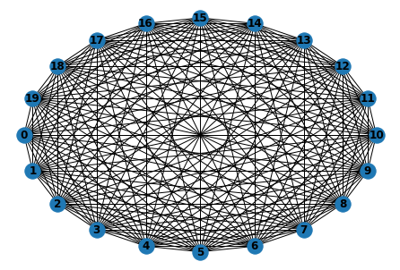
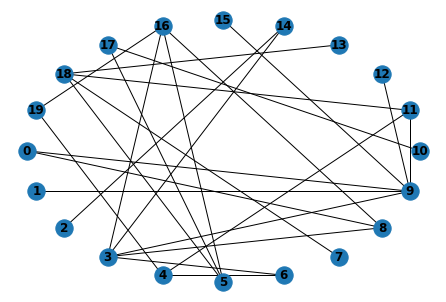

This is a notebook presenting the plots to give insight in the various model relations. Samples of various model elements are made to verify their functioning by checking hypotheses about their expected functioning. The agents will be tested according to: 
* Functionality of individual agents at extreme values
* Correct individual behaviour
* Correct interaction between agents

This will thus be conducted for: 
Individual household behaviour; 
Household-household interaction;
Household-Food ATM interaction;

All tests will be run for 30 days and so we can define the following: 


```{r}
# till what tick
cycles_in_day <- 6*24
days_runtime<-30
until = paste0(cycles_in_day*days_runtime)
```

---

## Individual household agent

One agent instantiated, variation over `alpha` regarding the evolution of `emotional_state` over time and `gamma` regarding the evolution of `demand` over time. A Our input parameters can be defined as: 

```{r}
params = data.frame("alpha"=c(0.0,0.0,0.5),"gamma"=c(0.0,30.0,10.0))
```

The observables are:
```{r}
obs = data.frame("tick"=1,"EmotionalState"=1,"DemandedFood"=1,"FoodInStorage"=1) # for in hh testing
```

The corresponding .gaml file containing the experiment is and tailored model initialisation: 
```{r}
path = "/home/daan/GAMA/workspace/FATM_ABM/main/household_verification/household_test.gaml"
```

Therewith choosing the right experiment with one replication:
```{r}
exp_name = "Startle"
replications <- 1
```

These steps replace the introduction steps in Sampling.Rmd and so from this point on we run the part in section *Running the model*. Taken the model is run and results are saved, we can load the results from a .csv file, set the samplesize and import plotting an data filtering libraries (ggplot2 and dplyr). 

```{r}
# graphs
library(ggplot2)
# data filtering
library(dplyr);

total_df <- read.csv("/home/daan/Desktop/Verification_results/IndividualHH_Startle.csv") 

samplesize <- nrow(total_df) / (cycles_in_day*days_runtime)
```

Then we can set the theme for the plots we will be creating: 

```{r}
theme <- theme(plot.title = element_text(family = "Helvetica", size = (17.5)),
                      legend.text = element_text(face = "italic", colour="black",family = "Helvetica"), 
                      axis.title = element_text(family = "Helvetica", size = (17.5), colour = "black"),
                      axis.text=element_text())
```

A plot of emotional state and food in storage output, respectively for:
* alpha in range 0,0.5
* gamma in range 0,30
Which are the only relevant variables in the context of individual household testing.

```{r}
df_tmp <- total_df #filter(total_df,beta==1,avg_pc==0.5,gamma==20.0,alpha>0)
samplesize <- nrow(df_tmp) / (cycles_in_day*days_runtime)

p <- ggplot()+xlim(0,cycles_in_day*days_runtime) +theme+ ggtitle("Emotional state: all value range") + labs(x="ticks [10 min]",y="Emotional state [-]",size=(200))
for (s in 0:(samplesize-1)) {
  until<-as.numeric(until)
  p<-p+geom_line(aes_string(x=as.numeric(df_tmp$tick[(s*until+1):((s+1)*until+1)]),y=as.numeric(df_tmp$EmotionalState[(s*until+1):((s+1)*until+1)]))) #
}
print(p)
```


```{r}
df_tmp <- total_df #filter(total_df,beta==1,avg_pc==0.5,gamma==20.0,alpha>0)
samplesize <- nrow(df_tmp) / (cycles_in_day*days_runtime)

p <- ggplot()+xlim(0,cycles_in_day*days_runtime) +theme+ ggtitle("Food in storage: all value range") + labs(x="ticks [10 min]",y="Food in storage [kg]",size=(200))
for (s in 0:(samplesize-1)) {
  until<-as.numeric(until)
  p<-p+geom_line(aes_string(x=as.numeric(df_tmp$tick[(s*until+1):((s+1)*until+1)]),y=as.numeric(df_tmp$FoodInStorage[(s*until+1):((s+1)*until+1)]))) #
}
print(p)
```

All runs are completed successfully and the graphs do not show unexpected behaviour.

Alpha represents the forgetting rate: a higher alpha implies a faster decreasing emotional state. For alpha in a range from 0.0 to 0.5 we see that the emotional state decreases more rapidly. 


```{r}
df_tmp <- filter(total_df,gamma==10.0)

p <- ggplot()+xlim(0,cycles_in_day*days_runtime) +theme+ ggtitle("Emotional state: alpha=[0.0 : 0.5] gamma=10") + labs(x="ticks [10 min]",y="Emotional state [-]",colour="alpha",size=(200))+scale_colour_gradient(low="lightblue",high="blue4")
for (s in 0:(samplesize-1)) {
  until<-as.numeric(until)
  p<-p+geom_line(aes_string(x=as.numeric(df_tmp$tick[(s*until+1):((s+1)*until+1)]),y=as.numeric(df_tmp$EmotionalState[(s*until+1):((s+1)*until+1)]),color=as.numeric(df_tmp$alpha[(s*until+1):((s+1)*until+1)]))) #
}
print(p)
```

An emotional state bigger than 0.5 influences the demand for food and thus food storage. For gamma=10 and varying alpha [0.0 : 0.5] it can be observed that food storage increases when the emotional state > 0.5 when demanding food. This is the case when alpha=0.0 or alpha0.1. 

```{r}
df_tmp <- filter(total_df,gamma==10.0)

p <- ggplot()+xlim(0,cycles_in_day*days_runtime) +theme+ ggtitle("Food in storage: alpha=[0.1 : 0.5] gamma=10") + labs(x="ticks [10 min]",y="Food in storage [kg]",colour="alpha",size=(200))+scale_colour_gradient(low="lightblue",high="blue4")
for (s in 0:(samplesize-1)) {
  until<-as.numeric(until)
  p<-p+geom_line(aes_string(x=as.numeric(df_tmp$tick[(s*until+1):((s+1)*until+1)]),y=as.numeric(df_tmp$FoodInStorage[(s*until+1):((s+1)*until+1)]),color=as.numeric(df_tmp$alpha[(s*until+1):((s+1)*until+1)]))) #
}
print(p)
```

gamma representing the default security stock of households, a high gamma implies a higher security stock. Varying gamma from 0.0 till 30.0 in steps of dgamma=10.0, the behaviour is confirmed. 

```{r}
df_tmp <- filter(total_df,alpha==0.1)

p <- ggplot()+xlim(0,cycles_in_day*days_runtime) +theme+ ggtitle("Food in storage: alpha=0.1 gamma=[0 : 30]") + labs(x="ticks [10 min]",y="Food in storage [kg]",colour="gamma",size=(200))+scale_colour_gradient(low="lightgreen",high="green4")
for (s in 0:(samplesize-1)) {
  until<-as.numeric(until)
  p<-p+geom_line(aes_string(x=as.numeric(df_tmp$tick[(s*until+1):((s+1)*until+1)]),y=as.numeric(df_tmp$FoodInStorage[(s*until+1):((s+1)*until+1)]),color=as.numeric(df_tmp$gamma[(s*until+1):((s+1)*until+1)]))) #
}
print(p)
```

The behaviour of an individual household agent without the emotional state set equal to 1 at tick=720 is expected to yield a food demand not influenced by the emotional state in any way. 
Without an emotional trigger we set:

```{r}
params = data.frame("alpha"=c(0.1,0.1,1.0),"gamma"=c(0.0,30.0,10.0)) # for ind hh testing without startle
exp_name = "NoStartle"
replications<-1

# Import a prepared datafile
total_df <- read.csv("/home/daan/Desktop/Verification_results/IndividualHH_NoStartle.csv") 
samplesize <- nrow(total_df) / (cycles_in_day*days_runtime)

```

And it can be observed the sudden increase in demand at tick=720 does not exist in this case. 

```{r}
df_tmp <- total_df

p <- ggplot()+xlim(0,cycles_in_day*days_runtime) +theme+ ggtitle("Food in storage: alpha=0.1 gamma=[0 : 30]") + labs(x="ticks [10 min]",y="Food in storage [kg]",colour="gamma",size=(200))+scale_colour_gradient(low="lightgreen",high="green4")
for (s in 0:(samplesize-1)) {
  until<-as.numeric(until)
  p<-p+geom_line(aes_string(x=as.numeric(df_tmp$tick[(s*until+1):((s+1)*until+1)]),y=as.numeric(df_tmp$FoodInStorage[(s*until+1):((s+1)*until+1)]),color=as.numeric(df_tmp$gamma[(s*until+1):((s+1)*until+1)]))) #
}
print(p)
```


## Household-household interaction

The multi-agent behaviour between 20 households in either a:
1) Fully connected 
2) Sparsely connected
Small world network. Every node is inter-reachable. Sparse network is randomly generated with every node having 3 edges on average. 






Household 0's emotional state is set to 1 at tick=720 and subsequently household 0 interacts with the network.
The variables of interest influencing this behaviour are: 
* alpha
* beta
* avg_pc
For extreme value testing, the parametres can be set to: 

```{r}
params = data.frame("alpha"=c(0.0,1.0,1.0),"beta"=c(0,1.0,1.0),"avg_pc"=c(0,1.0,1.0))
obs = data.frame("tick"=1,"AverageEmotionalState"=1,"EmotionalState"=1)
exp_name = "NetworkStartle"

total_df <- read.csv("/home/daan/Desktop/Verification_results/Network_EV.csv")
runtime <- 30*24*6
samplesize<-nrow(total_df)/runtime
```

```{r}
df_tmp <- total_df #filter(total_df,beta==1,avg_pc==0.5,gamma==20.0,alpha>0)
samplesize <- nrow(df_tmp) / (cycles_in_day*days_runtime)

p <- ggplot()+xlim(0,cycles_in_day*days_runtime) +theme+ ggtitle("Food in storage: all value range") + labs(x="ticks [10 min]",y="Food in storage [kg]",size=(200))
for (s in 0:(samplesize-1)) {
  until<-as.numeric(until)
  p<-p+geom_line(aes_string(x=as.numeric(df_tmp$tick[(s*until+1):((s+1)*until+1)]),y=as.numeric(df_tmp$AverageEmotionalState[(s*until+1):((s+1)*until+1)]))) #
}
print(p)
```

Variables of interest are alpha and beta. 

Randomness in the model obliges to run replications: the model results should be within the boundaries determined in the extreme value test. Our hypotheses will be tested according to statistic analysis of model behaviour rather than individual model runs. 

```{r}
params = data.frame("alpha"=c(0.1,0.5,0.4),"beta"=c(0,1.0,0.5))
obs = data.frame("tick"=1,"AverageEmotionalState"=1,"EmotionalState"=1)
exp_name = "NetworkStartle"

replications <- 50

total_df <- read.csv("/home/daan/Desktop/Verification_results/Network_full.csv")
runtime <- 30*24*6
samplesize<-nrow(total_df)/runtime
```


First we select beta=0 to show that there is no social interaction influencing the emotional state of households following a talkativity of 0.

```{r}
df_tmp <- filter(total_df,beta==0)

p <- ggplot()+xlim(0,cycles_in_day*days_runtime) +theme+ ggtitle("Avg Emotional State: alpha=[0.1,0.5] beta=0") + labs(x="ticks [10 min]",y="Average ES [-]",colour="alpha",size=(200))+scale_colour_gradient(low="lightblue",high="blue4")
for (s in 0:(samplesize-1)) {
  until<-as.numeric(until)
  p<-p+geom_line(aes_string(x=as.numeric(df_tmp$tick[(s*until+1):((s+1)*until+1)]),y=as.numeric(df_tmp$AverageEmotionalState[(s*until+1):((s+1)*until+1)]),color=as.numeric(df_tmp$alpha[(s*until+1):((s+1)*until+1)]))) #
}
print(p)
```


Alpha=0.1 is selected and a boxplots are made for beta=0.2 and beta=1.0

```{r}
# Boxplots
bplot <- ggplot()+ ylim(0,0.01)+ theme + ggtitle("Avg ES, full network, alpha=0.1, beta=[0.5,1.0]") + labs(x="ticks [10 min]",y="Average emotional state [-]",fill="beta")
for (s in 0:10) {
  df_tmp <- filter(total_df,tick==200*s,beta==0.5 ,alpha==0.1)
  bplot<-bplot + geom_boxplot(aes_string(x = 100*s-25,  y = df_tmp$AverageEmotionalState,fill=factor(df_tmp$beta)),width=40)
  
  df_tmp <- filter(total_df,tick==200*s,beta==1.0, alpha==0.1)
  bplot<-bplot + geom_boxplot(aes_string(x = 100*s+25,  y = df_tmp$AverageEmotionalState,fill=factor(df_tmp$beta)),width=40)
}
print(bplot)
```


And for alpha=0.5

```{r}
# Boxplots
bplot <- ggplot()+ theme + ggtitle("Avg ES, full network, alpha=0.5, beta=[0.5,1.0]") + labs(x="ticks [10 min]",y="Average emotional state [-]",fill="beta")
for (s in 0:20) {
  df_tmp <- filter(total_df,tick==200*s,beta==0.5,alpha==0.5)
  message(mean(df_tmp$AverageEmotionalState))
  bplot<-bplot + geom_boxplot(aes_string(x = 100*s-25,  y = df_tmp$AverageEmotionalState,fill=factor(df_tmp$beta)),width=40)
  
  df_tmp <- filter(total_df,tick==200*s,beta==1.0, alpha==0.5)
  bplot<-bplot + geom_boxplot(aes_string(x = 100*s+25,  y = df_tmp$AverageEmotionalState,fill=factor(df_tmp$beta)),width=40)
}
print(bplot)
```


For the sparse network
```{r}

total_df <- read.csv("/home/daan/Desktop/Verification_results/Network_sparse.csv")
runtime <- 30*24*6
samplesize<-nrow(total_df)/runtime
```


Boxplots alpha =0.1
```{r}
# Boxplots
bplot <- ggplot()+ theme + ggtitle("Avg ES, sparse network, alpha=0.1, beta=[0.5,1.0]") + labs(x="ticks [10 min]",y="Average emotional state [-]",fill="beta")
for (s in 0:10) {
  df_tmp <- filter(total_df,tick==200*s,beta==0.5 ,alpha==0.1)
  bplot<-bplot + geom_boxplot(aes_string(x = 100*s-25,  y = df_tmp$AverageEmotionalState,fill=factor(df_tmp$beta)),width=40)
  
  df_tmp <- filter(total_df,tick==200*s,beta==1.0, alpha==0.1)
  bplot<-bplot + geom_boxplot(aes_string(x = 100*s+25,  y = df_tmp$AverageEmotionalState,fill=factor(df_tmp$beta)),width=40)
}
print(bplot)
```

and alpha=0.5

```{r}
# Boxplots
bplot <- ggplot()+ theme + ggtitle("Avg ES, sparse network, alpha=0.5, beta=[0.5,1.0]") + labs(x="ticks [10 min]",y="Average emotional state [-]",fill="beta")
for (s in 0:20) {
  df_tmp <- filter(total_df,tick==200*s,beta==0.5, alpha==0.5)
  bplot<-bplot + geom_boxplot(aes_string(x = 100*s-25,  y = df_tmp$AverageEmotionalState,fill=factor(df_tmp$beta)),width=40)
  
  df_tmp <- filter(total_df,tick==200*s,beta==1.0, alpha==0.5)
  bplot<-bplot + geom_boxplot(aes_string(x = 100*s+25,  y = df_tmp$AverageEmotionalState,fill=factor(df_tmp$beta)),width=40)
}
print(bplot)
```


The difference between a densely and a sparsely connected network. 

```{r}
total_df1 <- read.csv("/home/daan/Desktop/Verification_results/Network_full.csv")
total_df2 <- read.csv("/home/daan/Desktop/Verification_results/Network_sparse.csv")
```


```{r}
# Boxplots
bplot <- ggplot()+ theme + ggtitle("Avg ES, sparse and full network, alpha=0.1, beta=1.0") + labs(x="ticks [10 min]",y="Average emotional state [-]",fill="beta")
for (s in 0:10) {
  df_tmp <- filter(total_df1,tick==180*s,beta==1.0, alpha==0.1)
  bplot<-bplot + geom_boxplot(aes_string(x = 100*s-25,  y = df_tmp$AverageEmotionalState,fill=factor("Full")),width=40)
  
  df_tmp <- filter(total_df2,tick==180*s,beta==1.0, alpha==0.1)
  bplot<-bplot + geom_boxplot(aes_string(x = 100*s+25,  y = df_tmp$AverageEmotionalState,fill=factor("Sparse")),width=40)
}
print(bplot)
```

## Households to facility

```{r}

path = "/home/daan/GAMA/workspace/FATM_ABM/main/facility_verification/facilities_test.gaml"
params = data.frame("ParallelServed"=c(1,10,1),"gamma"=c(1.0,30.0,1.0))


total_df <- read.csv("/home/daan/Desktop/Verification_results/HouseholdsToFacility.csv")

runtime <- 30*24*6 # days times hours times tick per hour 
samplesize <- nrow(total_df)/runtime
```

```{r}
df_tmp <- filter(total_df,gamma==1)
df_tmp <- filter(df_tmp,ParallelServed==1|ParallelServed==5|ParallelServed==10)

p <- ggplot()+xlim(0,500)+theme+ ggtitle("Length of queue, gamma=1, PllServed = [1,5,10]") + labs(x="ticks [10 min]",y="Length of queue [# people]",colour="PllServed",size=(200))+scale_colour_gradient(low="lightgreen",high="green4")

for (s in 0:(samplesize-1)) {
  until<-as.numeric(until)
  p<-p+geom_line(aes_string(x=as.numeric(df_tmp$tick[(s*until+1):((s+1)*until+1)]),y=as.numeric(df_tmp$QueueLength[(s*until+1):((s+1)*until+1)]),color=as.numeric(df_tmp$ParallelServed[(s*until+1):((s+1)*until+1)]))) #
}

print(p)
```


```{r}
df_tmp <- filter(total_df,gamma==10)
df_tmp <- filter(df_tmp,ParallelServed==1|ParallelServed==5|ParallelServed==10)

p <- ggplot()+xlim(0,500)+theme+ ggtitle("Length of queue, gamma=10, PllServed = [1,5,10]") + labs(x="ticks [10 min]",y="Length of queue [# people]",colour="PllServed",size=(200))+scale_colour_gradient(low="lightgreen",high="green4")

for (s in 0:(samplesize-1)) {
  until<-as.numeric(until)
  p<-p+geom_line(aes_string(x=as.numeric(df_tmp$tick[(s*until+1):((s+1)*until+1)]),y=as.numeric(df_tmp$QueueLength[(s*until+1):((s+1)*until+1)]),color=as.numeric(df_tmp$ParallelServed[(s*until+1):((s+1)*until+1)]))) #
}

print(p)
```

Decreasing gamma is also expected to increase the pressure on the FATM, and thus causing longer queues. 
```{r}

df_tmp <- filter(total_df,ParallelServed==5)
df_tmp <- filter(df_tmp,gamma==1|gamma==5|gamma==10)

p <- ggplot()+xlim(0,500)+theme+ ggtitle("Length of queue, gamma=[1,5,10], PllServed = 5") + labs(x="ticks [10 min]",y="Length of queue [# people]",colour="gamma",size=(200))+scale_colour_gradient(low="lightblue",high="blue4")

for (s in 0:(samplesize-1)) {
  until<-as.numeric(until)
  p<-p+geom_line(aes_string(x=as.numeric(df_tmp$tick[(s*until+1):((s+1)*until+1)]),y=as.numeric(df_tmp$QueueLength[(s*until+1):((s+1)*until+1)]),color=as.numeric(df_tmp$gamma[(s*until+1):((s+1)*until+1)]))) #
}

print(p)
```


Testing the reaction of households on a queue with a certain length. 


```{r}

path = "/home/daan/GAMA/workspace/FATM_ABM/main/facility_verification/QReaction_test.gaml"
params = data.frame("alpha"=c(0.1,0.1,0.4),"beta"=c(0,1.0,1.0), "ParallelServed"=c(1,5,4), "epsilon"=c(0,1.0,0.5), "gamma"=c(1,11,5))  # Queue testing

replications<-1 

total_df <- read.csv("/home/daan/Desktop/Verification_results/FacilityToHouseholds.csv")

runtime <- 30*24*6 # days times hours times tick per hour 
samplesize <- nrow(total_df)/runtime
```

It can be observed how the pattern of people queuing and subsequent increase in emotional state is reflected in the graph. 

```{r}
df_tmp <- filter(total_df,beta==0)
df_tmp <- filter(df_tmp,ParallelServed==5,gamma==11)

p <- ggplot()+theme+ ggtitle("Avg emotional state, gamma=11, PllServed = 5") + labs(x="ticks [10 min]",y="Avg ES [-]",colour="epsilon",size=(200))+scale_colour_gradient(low="lightgreen",high="green4")

for (s in 0:(samplesize-1)) {
  until<-as.numeric(until)
  p<-p+geom_line(aes_string(x=as.numeric(df_tmp$tick[(s*until+1):((s+1)*until+1)]),y=as.numeric(df_tmp$AverageEmotionalState[(s*until+1):((s+1)*until+1)]),color=as.numeric(df_tmp$epsilon[(s*until+1):((s+1)*until+1)]))) #
}

print(p)
```

An increase in emotional state increases the demand for food and the reinforcing effect on the total length of the queue. 

```{r}
df_tmp <- filter(total_df,beta==0)
df_tmp <- filter(df_tmp,ParallelServed==5,gamma==11)

p <- ggplot()+theme+ ggtitle("Length of queue, gamma=11, PllServed = 5") + labs(x="ticks [10 min]",y="Length of queue [# people]",colour="epsilon",size=(200))+scale_colour_gradient(low="lightblue",high="blue4")

for (s in 0:(samplesize-1)) {
  until<-as.numeric(until)
  p<-p+geom_line(aes_string(x=as.numeric(df_tmp$tick[(s*until+1):((s+1)*until+1)]),y=as.numeric(df_tmp$QueueLength[(s*until+1):((s+1)*until+1)]),color=as.numeric(df_tmp$epsilon[(s*until+1):((s+1)*until+1)]))) #
}

print(p)
```


